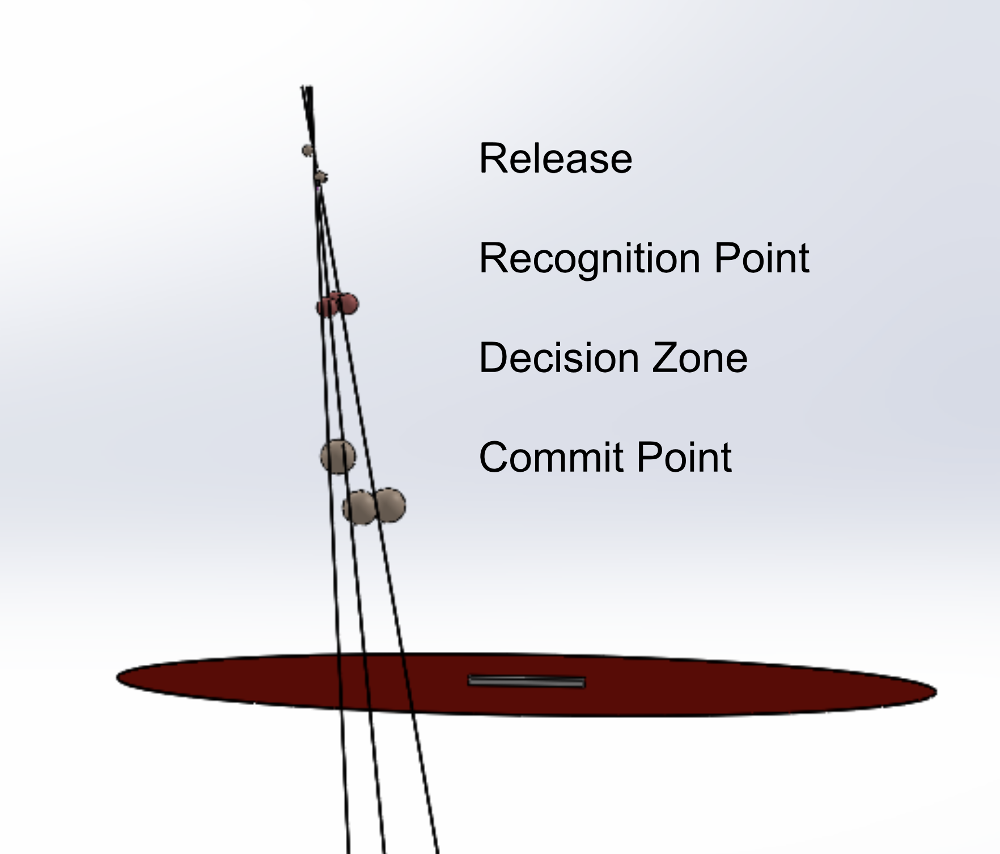
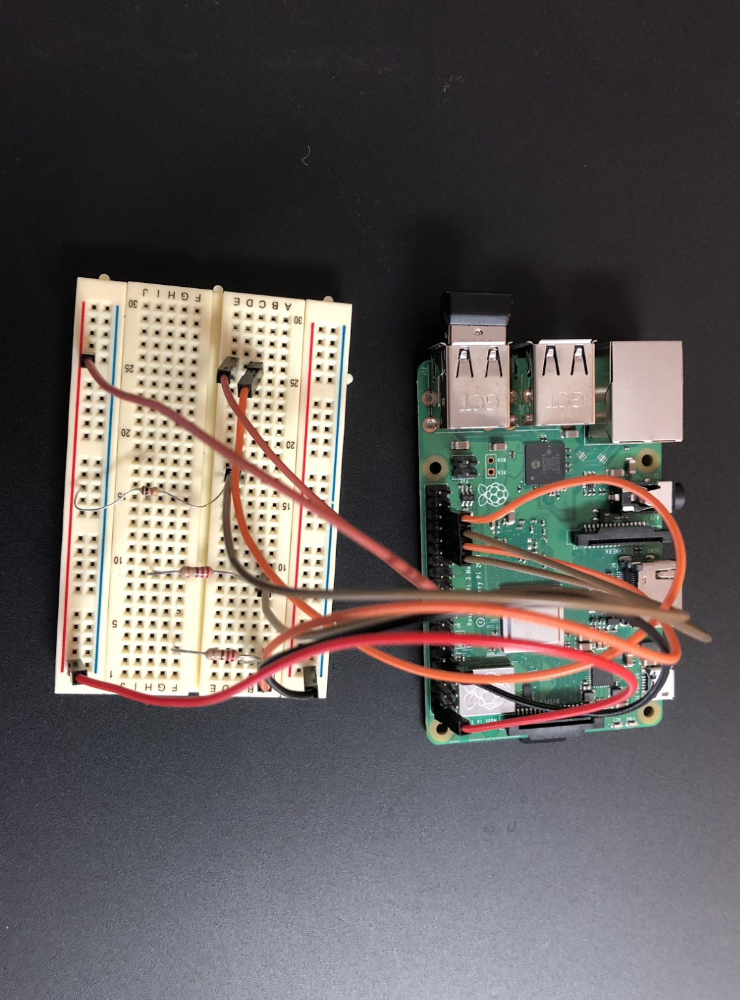
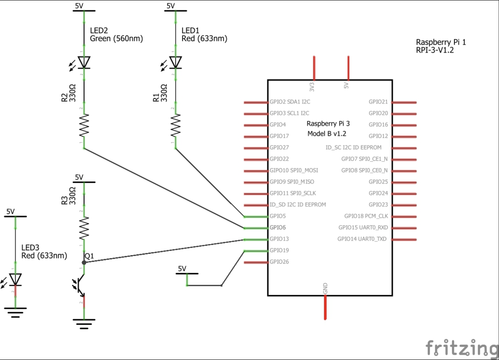

# Experimentally Determining The "Commit Point" - Evaluating the time it takes a hitter to check his swing
Authors: [Joe Petrich](http://github.com/jpetrich) and [Dr. William Clark](https://www.engineering.pitt.edu/WilliamClark/)

## Motivations
Our interest in determining the commit point was is rooted in the pitch tunneling
conversation. Knowing the last point in a pitch's trajectory that a batter can
check his swing lets us know how long two pitches need to share a tunnel to be
impossible to tell apart.

In early 2018, we hypothesized that the commit point
would be at 167ms before the pitch reaches the front of the plate. We came to
this number by looking at Diamond Kinetics' trigger to impact time metric which
measures the time from when the bat starts its swinging motion to when impact
is made. For elite hitters, this time is usually <200ms. However, studies on
checked swings are few and far between, and none had experimentally attempted to
pinpoint the commit point, so we decided to create an experiment ourselves.

## The Experiment

### Methods
Balls were pitched to a hitter from a pitching machine. The machine was
instrumented with
* a light-gate sensor to detect ball exit
* green and red LEDs as signals to the hitter to swing or check

The instrumentation was controlled by a Raspberry Pi to allow millisecond timing
and synchronization of the data with SwingTracker sensor data and video. The
hitter was instructed to take full swings and hit the ball hard when the green
light was on, and to check the swing when the red light appeared.

### Random Checked Swing Process

For normal swings, the logic proceeded as follows:
1. The Raspberry Pi normally displayed the green LED
2. A random count of pitches to be hit, from 0 to 3, was created
3. Balls were pitched with the green LED on so the hitter swung
4. The light gate detected the pitch, and the count was decremented

Once the count reached 0, though
1. The light gate detected the pitch, and a random delay from 10 to 250ms was
begun when the next ball was detected by the light gate.
2. At the end of the delay, the green LED was turned off, and the red LED was
turned on, signaling the batter to check his swing.

Successfully checked swing (note the thumbs-up at the end indicating the hitter
  checked because the light came on):
  <video src="check.mp4" width="320" height="200" controls preload></video>

Failure to check swing (in this case, the thumbs-up means the hitter saw the
  light and couldn't check):
  <video src="failed.mp4" width="320" height="200" controls preload></video>
