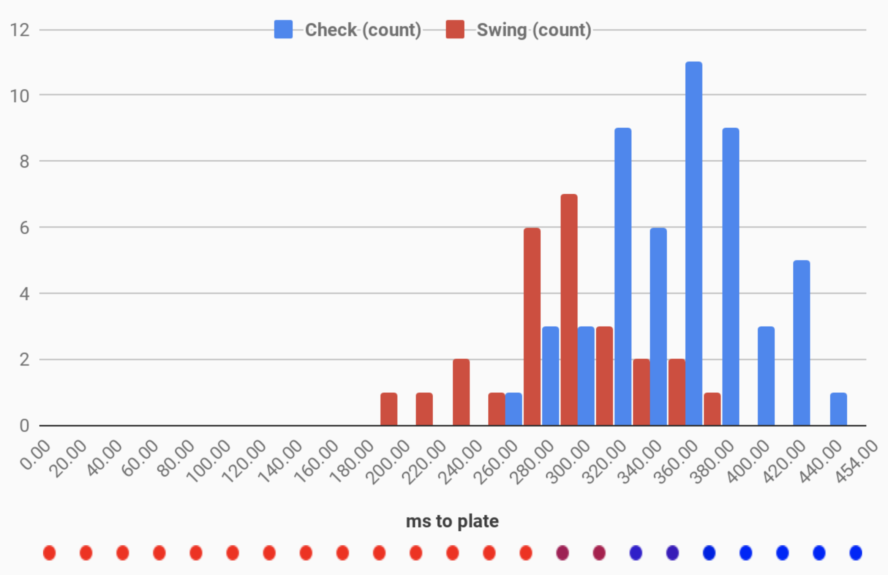
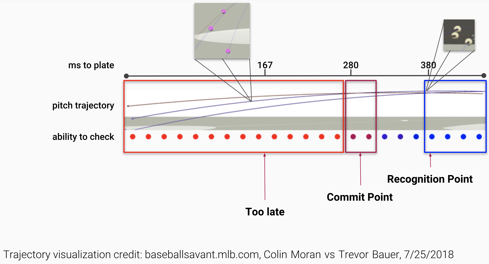

# Experimentally Determining The "Commit Point" - Evaluating the time it takes a hitter to check his swing
Authors: [Joe Petrich](http://github.com/jpetrich) and [Dr. William Clark](https://www.engineering.pitt.edu/WilliamClark/)

## Motivations
Our interest in determining the commit point was is rooted in the pitch tunneling
conversation. Knowing the last point in a pitch's trajectory that a batter can
check his swing lets us know how long two pitches need to share a tunnel to be
impossible to tell apart.

In early 2018, we hypothesized that the commit point
would be at 167ms before the pitch reaches the front of the plate. We came to
this number by looking at Diamond Kinetics' trigger to impact time metric which
measures the time from when the bat starts its swinging motion to when impact
is made. For elite hitters, this time is usually <200ms. However, studies on
checked swings are few and far between, and none had experimentally attempted to
pinpoint the commit point, so we decided to create an experiment ourselves.

## The Experiment

### Methods
Balls were pitched to a hitter from a pitching machine. The machine was
instrumented with
* a light-gate sensor to detect ball exit
* green and red LEDs as signals to the hitter to swing or check

The instrumentation was controlled by a Raspberry Pi to allow millisecond timing
and synchronization of the data with SwingTracker sensor data and video. The
hitter was instructed to take full swings and hit the ball hard when the green
light was on, and to check the swing when the red light appeared.

### Random Checked Swing Process

For normal swings, the logic proceeded as follows:
1. The Raspberry Pi normally displayed the green LED
2. A random count of pitches to be hit, from 0 to 3, was created
3. Balls were pitched with the green LED on so the hitter swung
4. The light gate detected the pitch, and the count was decremented

Once the count reached 0, though
1. The light gate detected the pitch, and a random delay from 10 to 250ms was
begun when the next ball was detected by the light gate.
2. At the end of the delay, the green LED was turned off, and the red LED was
turned on, signaling the batter to check his swing.

Successfully checked swing (note the thumbs-up at the end indicating the hitter
  checked because the light came on):
  <video src="check.mp4" width="320" height="200" controls preload></video>

Failure to check swing (in this case, the thumbs-up means the hitter saw the
  light and couldn't check):
  <video src="failed.mp4" width="320" height="200" controls preload></video>

## Results

Our hitter's commit point was around 280ms before plate. This is over 100ms
earlier than we had previously estimated. This is due to a number of factors,
both physical and mental. Below is a histogram of checked swing attempts, 77 in
total, with delays from 12-243ms, which corresponds to 196-440ms before plate:

As you can see, all checks were successful if the batter had at least 380ms
before plate, and all checks were unsuccessful if he had less than 240ms. The
plot above is from 0 to 454ms to represent the flight time of the ball from
release to plate. In our case, this was 60mph at 40' which is equivalent to about
80mph at 55'.

Looking at the colored dots next to a diagram of pitch trajectories from
[Baseball Savant](http://baseballsavant.com), you can see what the different
pitches look like at the recognition point and our earlier hypothesis of commit
point. However, the commit point is likely more than 100ms earlier, which
increases the likelihood that two pitches share a tunnel at that point.

### What factors affect the commit point?

When trying to account for the 100ms we were off by when estimating the commit
point, we came up with the following factors that could all play a role:
* The biomechanics of a swing start before the bat moves, so trigger to impact
time may not be the best metric to start with since it only measures the time
of the swing from when the bat starts to move
* Our hitter's mindset was to hit with maximum effort; expecting a need to check
swing could push the commit point farther, for example, in counts when a batter
would expect an offspeed or breaking pitch
* Pitch location varied in our experiment, so our hitter's instinct to swing or
check based on pitch location sometimes conflicted with the indication from the
LEDs

### Future Work

To further refine our understanding of the commit point, here are some ideas for
future research:
* Repeat this study with more hitters
* Isolate factors that affect the commit point such as pitch location
* Collect organic check swing data in-game or in simulated games using swing
sensors and/or high speed cameras
* Research a better metric than trigger to impact time for measuring the time of
a swing from any body movement to impact
* Evaluate the theoretical latest commit point using a physics and biomechanics
model of a swing

## Acknowledgements

Thank you to Russell Clark, Laura Clark, Alyssa Clark, and Dr. Minmin Zhang for
their assistance with data collection and analysis. Thank you also to Brian
Barca of Training KAMP Baseball and Softball for use of his facilities.
